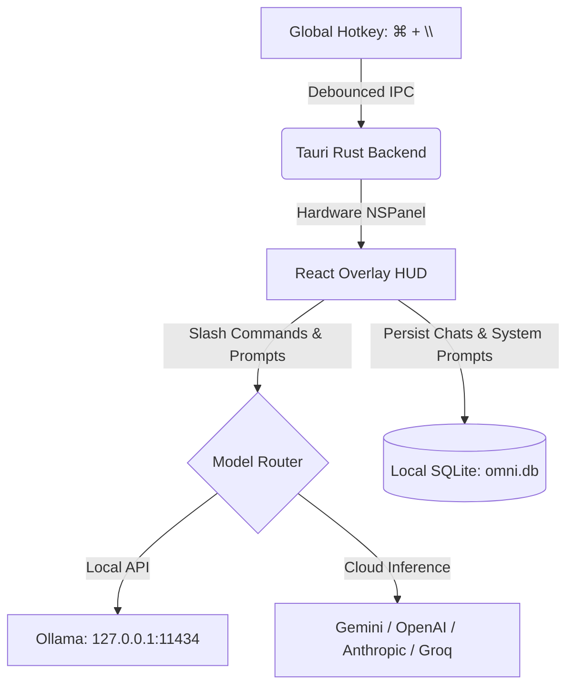

<div align="center">

# Omni ⚡

### Fast, privacy-first AI desktop companion built with Tauri v2, Rust & React.

[](LICENSE)
[](https://tauri.app)
[](https://www.rust-lang.org)
[](https://react.dev)
[](#)

</div>

---

## ⚡ Highlights

* **Instant HUD Overlay**: Summon floating command bar anywhere via `⌘ + \` (customizable).
* **Zero Telemetry / 100% Local-First**: Keys & chats stay on disk in SQLite (`omni.db`). No tracking.
* **Instant Slash Commands**: `/fix`, `/explain`, `/code`, `/summarize`, `/regex`, `/clear`.
* **Keyboard History**: Press `↑` / `↓` in input box to cycle through recent prompts.
* **1-Click Local Ollama Detection**: Auto-detects local models (`http://127.0.0.1:11434`) without manual configuration.
* **Multimodal Vision**: Screenshot desktop areas (`⌘ + Shift + S`) for instant visual reasoning.
* **Hardware Debounced & Optimized**: Thin LTO, sub-5ms window response, 0 key-repeat HUD flicker.

---

## ⌨️ Default Shortcuts

| Action | macOS | Windows / Linux |
| :--- | :--- | :--- |
| **Toggle HUD Overlay** | `⌘ + \` | `Ctrl + \` |
| **Toggle Full Space** | `⌘ + Shift + D` | `Ctrl + Shift + D` |
| **Refocus Input** | `⌘ + Shift + I` | `Ctrl + Shift + I` |
| **Move Overlay** | `⌘ + Arrow Keys` | `Ctrl + Arrow Keys` |
| **Area Screenshot** | `⌘ + Shift + S` | `Ctrl + Shift + S` |
| **System Audio Capture** | `⌘ + Shift + M` | `Ctrl + Shift + M` |

---

## 🏗️ Architecture



---

## 🛠️ Build & Install

### Prerequisites
* Node.js 18+
* Rust (`cargo`, `rustc`)

### Development
```bash
npm install
npm run tauri dev
```

### Production Release Build
```bash
npm run tauri build
# Bundle located at: src-tauri/target/release/bundle/macos/Omni.app
```

---

## 📄 License

Distributed under the [Apache-2.0 License](LICENSE). Copyright © 2026 Connor Tessaro.
