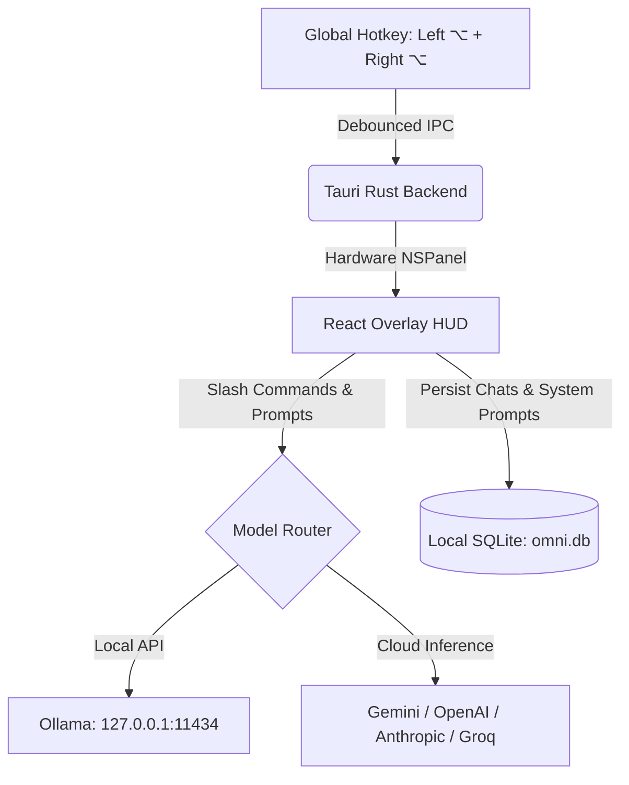

<div align="center">


# Omni ⚡

### Local-first AI assistant for the desktop. Tauri v2, Rust, React.

[](LICENSE)
[](https://tauri.app)
[](https://www.rust-lang.org)
[](https://react.dev)
[](#)

</div>

> Omni is a fork of [Pluely](https://github.com/iamsrikanthnani/pluely) by Srikanth Nani,
> licensed under GPL-3.0. See [NOTICE.md](NOTICE.md).

---

## ⚡ Highlights

* **HUD Overlay**: Summon a floating command bar anywhere by pressing both `⌥` keys together (customizable).
* **Zero Telemetry**: Keys and chats stay on disk in SQLite (`omni.db`). No tracking, no license server, no usage reporting.
* **Slash Commands**: `/solve` (multi-step, with tools), `/answer` (verdict-first assessment answers), `/fix`, `/commit`, `/refactor`, `/explain`, `/code`, `/summarize`, `/translate`, `/regex`, `/clear`.
* **Keyboard History**: Press `↑` / `↓` in the input box to cycle through recent prompts.
* **Model Switching**: Pick any model your configured key has access to, without re-entering it. Local Ollama models are detected at `http://127.0.0.1:11434`.
* **Vision**: Screenshot a desktop area (press both `⌘` keys together) and ask about it.
* **Prompt Profiles**: Eight built-ins, switchable from the chip in the HUD, split by what you do with the answer. Type it: `Code`, `Assessment`, `Debug`, `SQL`, `Frontend`. Say it: `Live Interview`, `Behavioral`, `System Design`.
* **Assessment Answers**: The `Assessment` prompt profile and `/answer` return the verdict first: the chosen option letters, the runnable solution, or the files touched, with the reasoning folded behind it and a jump rail for multi-file answers.
* **Run Before You Trust**: A Python, JavaScript or TypeScript answer gets a **Run tests** button. It writes the answer's files to a scratch directory, runs the test file with a 10s timeout, and reports `12 passed` or the assertion that broke. The code runs locally as you, with no network jail: read it before you click.

---

## ⌨️ Default Shortcuts

The HUD sits on top of whatever app you are using, and a global shortcut takes the
key away from that app. So the macOS defaults keep off the crowded `⌘ + Shift`
prefix: the actions you reach for most are **modifier chords** — hold one
modifier's left and right key together — and the rest sit on `⌘ + Ctrl`. Nothing
in macOS binds a left+right pair, so a chord cannot collide with the app
underneath. Every binding is rebindable in Settings → Shortcuts.

| Action | macOS | Windows / Linux |
| :--- | :--- | :--- |
| **Toggle HUD Overlay** | Left `⌥` + Right `⌥` | `Ctrl + \` |
| **Screenshot** | Left `⌘` + Right `⌘` | `Ctrl + Shift + S` |
| **Voice Input** | Left `⇧` + Right `⇧` | `Ctrl + Shift + A` |
| **Capture Region** | `⌘ + Ctrl + R` | `Ctrl + Shift + R` |
| **System Audio Capture** | `⌘ + Ctrl + L` | `Ctrl + Shift + M` |
| **Refocus Input** | `⌘ + Ctrl + I` | `Ctrl + Shift + I` |
| **Toggle Full Space** | `⌘ + Shift + \` | `Ctrl + Shift + D` |
| **Move Overlay** | `⌘ + Arrow Keys` | `Ctrl + Arrow Keys` |

Chords are detected by polling Quartz for key state, which needs no Accessibility
or Input Monitoring permission. A chord has to be held briefly before it fires, and
is ignored while any other modifier is down, so it cannot be tripped by an ordinary
`⌘ + Shift` shortcut in the app underneath.

---

## 🏗️ Architecture



---

## 🛠️ Build & Install

### Prerequisites
* Node.js 18+
* Rust (`cargo`, `rustc`)

### Development
```bash
npm install
npm run tauri dev
```

### Production Release Build
```bash
npm run tauri build
# Bundle located at: src-tauri/target/release/bundle/macos/Omni.app
```

### macOS: keeping privacy permissions across rebuilds

`npm run tauri build` signs ad-hoc, which produces no certificate. macOS then
pins each privacy grant to the binary's cdhash, and a cdhash changes on every
build. Omni keeps appearing under **Privacy & Security** with its toggle **on**
while macOS denies screen capture and audio, and because the entry already
exists you never see a new prompt.

Sign with a stable local certificate instead, once per machine:

```bash
npm run signing:create        # self-signed identity in its own keychain
npm run tauri:build:signed    # build with it
```

The designated requirement then names the certificate rather than the binary:

```
identifier "com.connortessaro.omni" and certificate root = H"…"
```

That holds across rebuilds, so you grant permissions once. Clear the stale ones
after the first signed build:

```bash
npm run privacy:reset         # macOS prompts again on next launch
```

`scripts/build-signed.sh` passes the identity through `APPLE_SIGNING_IDENTITY`
rather than `tauri.conf.json`. That config is committed, and the release workflow
builds on GitHub runners without this certificate, so hardcoding it there would
break every CI release build.

---

## 📄 License

Omni is a fork of [Pluely](https://github.com/iamsrikanthnani/pluely) by Srikanth Nani,
and is distributed under the [GNU General Public License v3.0](LICENSE), the same license
as upstream. See [NOTICE.md](NOTICE.md) for attribution, the list of modifications made in
this fork, and the license history.
