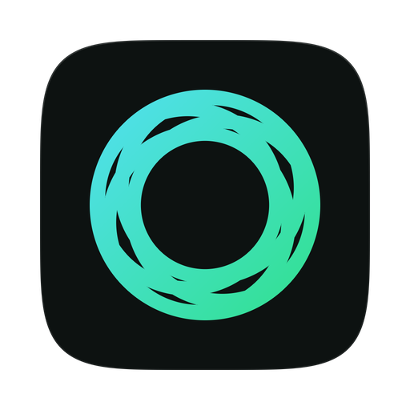
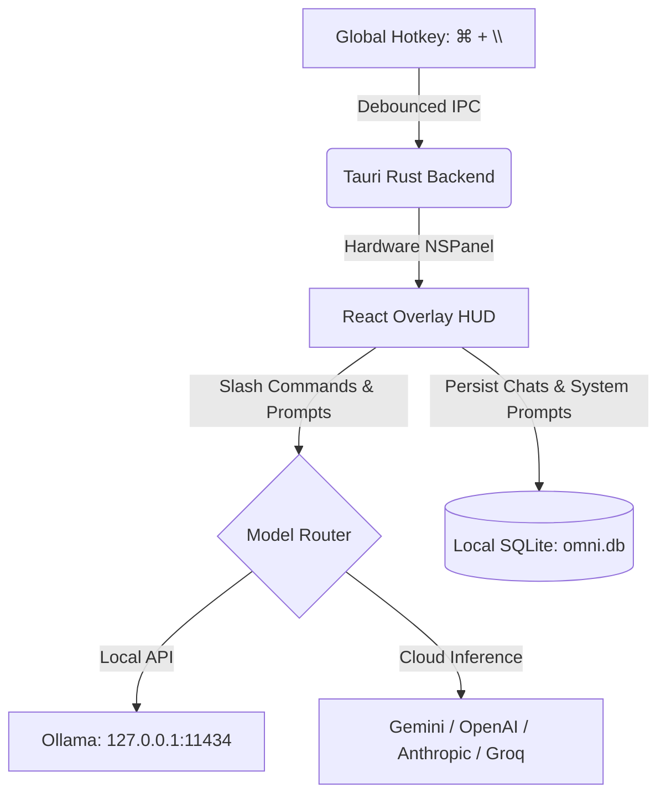

<div align="center">



# Omni ⚡

### Local-first AI assistant for the desktop. Tauri v2, Rust, React.

[](LICENSE)
[](https://tauri.app)
[](https://www.rust-lang.org)
[](https://react.dev)
[](#)

</div>

---

## ⚡ Highlights

* **HUD Overlay**: Summon a floating command bar anywhere via `⌘ + \` (customizable).
* **Zero Telemetry**: Keys and chats stay on disk in SQLite (`omni.db`). No tracking, no license server, no usage reporting.
* **Slash Commands**: `/solve` (multi-step, with tools), `/fix`, `/commit`, `/refactor`, `/explain`, `/code`, `/summarize`, `/translate`, `/regex`, `/clear`.
* **Keyboard History**: Press `↑` / `↓` in the input box to cycle through recent prompts.
* **Model Switching**: Pick any model your configured key has access to, without re-entering it. Local Ollama models are detected at `http://127.0.0.1:11434`.
* **Vision**: Screenshot a desktop area (`⌘ + Shift + S`) and ask about it.

---

## ⌨️ Default Shortcuts

| Action | macOS | Windows / Linux |
| :--- | :--- | :--- |
| **Toggle HUD Overlay** | `⌘ + \` | `Ctrl + \` |
| **Toggle Full Space** | `⌘ + Shift + D` | `Ctrl + Shift + D` |
| **Refocus Input** | `⌘ + Shift + I` | `Ctrl + Shift + I` |
| **Move Overlay** | `⌘ + Arrow Keys` | `Ctrl + Arrow Keys` |
| **Area Screenshot** | `⌘ + Shift + S` | `Ctrl + Shift + S` |
| **System Audio Capture** | `⌘ + Shift + M` | `Ctrl + Shift + M` |

---

## 🏗️ Architecture



---

## 🛠️ Build & Install

### Prerequisites
* Node.js 18+
* Rust (`cargo`, `rustc`)

### Development
```bash
npm install
npm run tauri dev
```

### Production Release Build
```bash
npm run tauri build
# Bundle located at: src-tauri/target/release/bundle/macos/Omni.app
```

### macOS: keeping privacy permissions across rebuilds

`npm run tauri build` signs ad-hoc, which produces no certificate. macOS then
pins each privacy grant to the binary's cdhash, and a cdhash changes on every
build. Omni keeps appearing under **Privacy & Security** with its toggle **on**
while macOS denies screen capture and audio, and because the entry already
exists you never see a new prompt.

Sign with a stable local certificate instead, once per machine:

```bash
npm run signing:create        # self-signed identity in its own keychain
npm run tauri:build:signed    # build with it
```

The designated requirement then names the certificate rather than the binary:

```
identifier "com.connortessaro.omni" and certificate root = H"…"
```

That holds across rebuilds, so you grant permissions once. Clear the stale ones
after the first signed build:

```bash
npm run privacy:reset         # macOS prompts again on next launch
```

`scripts/build-signed.sh` passes the identity through `APPLE_SIGNING_IDENTITY`
rather than `tauri.conf.json`. That config is committed, and the release workflow
builds on GitHub runners without this certificate, so hardcoding it there would
break every CI release build.

---

## 📄 License

Distributed under the [Apache-2.0 License](LICENSE). Copyright © 2026 Connor Tessaro.
