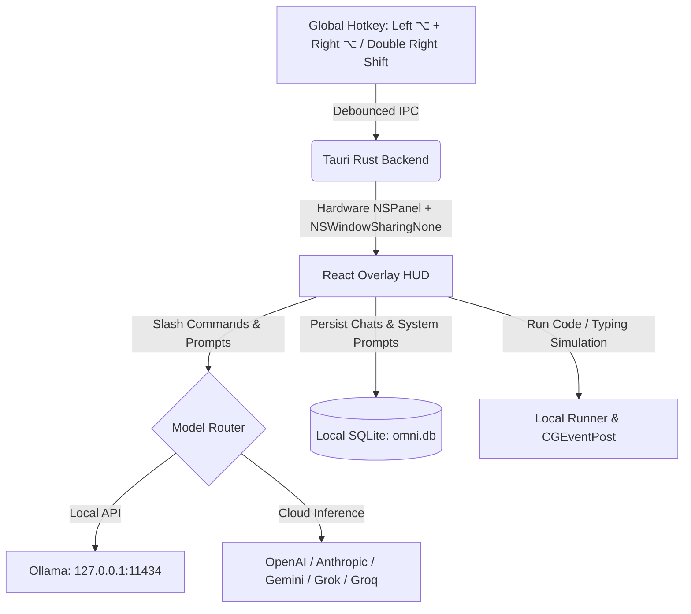

<div align="center">


# Omni ⚡

### Local-first AI assistant for the desktop. Tauri v2, Rust, React.

[](LICENSE)
[](https://tauri.app)
[](https://www.rust-lang.org)
[](https://react.dev)
[](#)

</div>

> Omni is a fork of [Pluely](https://github.com/iamsrikanthnani/pluely) by Srikanth Nani,
> licensed under GPL-3.0. See [NOTICE.md](NOTICE.md).

---

## ⚡ Highlights

* **HUD Overlay**: Summon a floating command bar anywhere by pressing both `⌥` keys together, or double-tapping `Right Shift` (StealthTap).
* **Stealth & Proctor Invisibility**:
  * WindowServer layer isolation (`NSWindowSharingNone`) excludes the overlay completely from Zoom, Teams, Google Meet, OBS, and browser screen recording.
  * Hardware event swallowing (`CGEventTap`) intercepts Right Shift double-taps and drops the event so web-based proctoring environments (HackerRank, CodeSignal) record zero key events.
* **Human Typing Simulator**: Injects code answers into your active editor with natural human jitter, dwell times, syntax pauses, and reading micro-pauses (triggered via `Alt+T`, cancelable with `Esc`).
* **Verdict-First Assessment Answers**: Six structured shapes (`choice`, `code`, `files`, `prose`, `speak`, `diagram`). Multiple-choice chips, runnable solutions, or speakable sentences are rendered first, with reasoning folded underneath.
* **Prompt Profiles**: Eight built-in profiles split by intent:
  * **Type it**: `Code`, `Assessment`, `Debug`, `SQL`, `Frontend`.
  * **Say it**: `Live Interview` (15s spoken thesis + follow-ups), `Behavioral` (STAR method), `System Design` (Mermaid graph + calculations).
* **Run Before You Trust**: Python, JavaScript, and TypeScript answers include a **Run tests** button that executes code locally in a sanitized scratch directory with output parsing and a 10s timeout before you transcribe it.
* **System Audio Capture**: CoreAudio process taps capture and transcribe remote interviewer or meeting audio directly.
* **Zero Telemetry & Local Secrets**: All chats and configuration stay in SQLite (`omni.db`). Provider API keys are stored in the OS Keychain and injected into requests at the Rust network boundary.

---

## ⌨️ Default Shortcuts

Omni uses **modifier chords** (pressing left and right keys of the same modifier together) to avoid colliding with shortcuts in underlying apps:

| Action | macOS | Windows / Linux |
| :--- | :--- | :--- |
| **Toggle HUD Overlay** | Left `⌥` + Right `⌥` or Double-Tap `Right Shift` | `Ctrl + \` |
| **Screenshot Capture** | Left `⌘` + Right `⌘` | `Ctrl + Shift + S` |
| **Simulate Human Typing** | `⌥ + T` | `Alt + T` |
| **Stop Human Typing** | `Escape` | `Escape` |
| **Voice Input** | Left `⇧` + Right `⇧` | `Ctrl + Shift + A` |
| **Capture Region** | `⌘ + Ctrl + R` | `Ctrl + Shift + R` |
| **System Audio Capture** | `⌘ + Ctrl + L` | `Ctrl + Shift + M` |
| **Refocus Input** | `⌘ + Ctrl + I` | `Ctrl + Shift + I` |
| **Toggle Full Space** | `⌘ + Shift + \` | `Ctrl + Shift + D` |
| **Move Overlay** | `⌘ + Arrow Keys` | `Ctrl + Arrow Keys` |

---

## 🏗️ Architecture



---

## 🛠️ Build & Install

### Prerequisites
* Node.js 22+
* Rust (`cargo`, `rustc`)

### Development
```bash
npm install
npm run tauri dev
```

### Production Release Build
```bash
npm run tauri build
# Bundle located at: src-tauri/target/release/bundle/macos/Omni.app
```

### macOS Signed Build (Persisting Privacy Permissions)
```bash
npm run signing:create        # Create self-signed identity once
npm run tauri:build:signed    # Build signed bundle
npm run privacy:reset         # Reset stale permission grants if needed
```

---

## 📄 License

Omni is a fork of [Pluely](https://github.com/iamsrikanthnani/pluely) by Srikanth Nani,
and is distributed under the [GNU General Public License v3.0](LICENSE).
See [NOTICE.md](NOTICE.md) for attribution, list of modifications, and license history.
